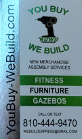

# Zeyland R. Holden - Computer Engineering Student

[Zeylandrholden11@gbstu.org](mailto:Zeylandrholden11@gbstu.org)

# Experience
I am well-versed in Java-oriented programming languages (such as Java, C, C#, and C++), 3d modeling, and general content creation (Video Editing, Image editing, 3d Modeling).

   
   

## Media Creation

I am a part of a local-scale family business, [You Buy We Build](youbuy-webuild.com). We assemble most merchandise - from boxed furniture to large gazebos.

I am currently initiating a social media presence with the company and will be periodically uploading videos of assembly to reach viewers this summer.

I have also collaborated to create the company logo, design the newest business card, and have frequently contributed to on-site operations.

# Projects

## In Progress
I am currently working on a Resin Lens that uses a unique fluid principle to create dimensionally accurate lenses with exceptionally cheap and accessible parts.

<!--
**ZeylandH/ZeylandH** is a ✨ _special_ ✨ repository because its `README.md` (this file) appears on your GitHub profile.

Here are some ideas to get you started:

- 🔭 I’m currently working on ...
- 🌱 I’m currently learning ...
- 👯 I’m looking to collaborate on ...
- 🤔 I’m looking for help with ...
- 💬 Ask me about ...
- 📫 How to reach me: ...
- 😄 Pronouns: ...
- ⚡ Fun fact: ...
-->
